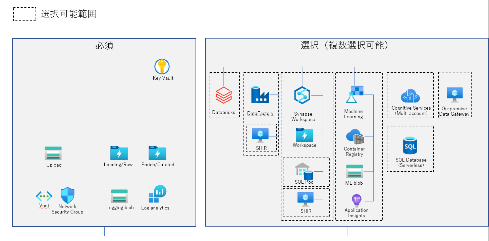

#　Azure Analytics DevEnv

※Cognitiveは開発中

## 利用方法について

上部のDeploy to Azure ボタンをクリックしてテンプレートを実行できます。

パラメータファイルがある場合は繰り返し同じ定義をデプロイできるのでおすすめです。

### 前提条件

- 対象リソースグループの所有者権限が必要です。
- 自身を含むセキュリティグループを作成してください。
  - 参考：[基本グループを作成してメンバーを追加する](https://docs.microsoft.com/ja-jp/azure/active-directory/fundamentals/active-directory-groups-create-azure-portal#create-a-basic-group-and-add-members)

### パラメータ定義

定義よりパラメータを決定してください。
パラメータファイルのサンプルは[こちら](infra/sample_params.json)

| パラメータ名                          | 説明                                                                             |
|---------------------------------|--------------------------------------------------------------------------------|
| location                        | リソースのデプロイリージョン                                                                 |
| project                         | リソース名はproject-deployment_id-リソース種類-envとなります                                    |
| env                             | リソース名はproject-deployment_id-リソース種類-envとなります                                    |
| deployment_id                   | リソース名はproject-deployment_id-リソース種類-envとなります                                    |
| AdminGroupName                  | セキュリティグループの名称を入力すると自動で権限が付与されます                                                |
| AdminGroupObjectID              | セキュリティグループのオブジェクトIDを入力すると自動で権限が付与されます                                          |
| VMAdministratorLogin            | 各VMのログインID                                                                     |
| VMAdministratorLoginPassword    | 各VMのログインパスワード（12文字以上）                                                          |
| addressPrefixs                  | Vnet範囲                                                                         |
| runtimeSubnetPrefix             | 統合ランタイム、Power BI Gateway用VM用サブネット                                              |
| privateEndpointSubnetPrefix     | Private Endpoint用サブネット                                                         |
| mlcomputesSubnetPrefix          | Azure ML用サブネット                                                                 |
| adbPublicSubnetPrefix           | Databricks用 Publicサブネット                                                        |
| adbPrivateSubnetPrefix          | Databricks用 Privateサブネット                                                       |
| WhiteListsStartEndIPs           | 許可したいIP開始終了の配列                                                                 |
| WhiteListsCIDRs                 | 許可したいCIDR形式IPの配列                                                               |
| isNeedDatabricks                | true の場合Databrikcsをデプロイします。                                                    |
| databricksAppObjectId           | databricks application のobject id [確認方法](docs/checkDatabricksApplication.md)                                             |
| isNeedDataFactory               | true の場合DataFactoryをデプロイします。                                                   |
| isNeedSHIRforDataFactory        | true の場合DataFactory用セルフホステッド統合ランタイムをデプロイします。isNeedDataFactoryをFalseにした場合は無効です。 |
| isNeedMachineLearning           | true の場合Azure Machine Learningをデプロイします。                                        |
| isNeedSynapse                   | true の場合Synapse Analyticsをデプロイします。                                             |
| isDLPEnable                     | true の場合Syanpse workspaceのデータ流出保護を有効にします※一部機能に制限がかかります。                        |
| AllowAzure                      | true の場合Azureからの接続をすべて許可します。Synapse,SQLDBで共通                            |
| sqlAdministratorUsername        | sql管理者ユーザー名                                                                    |
| sqlAdministratorPassword        | sql管理者ユーザーパスワード。空欄可能                                                           |
| isNeedSqlPool                   | true の場合専用SQLPoolをデプロイします。                                                     |
| collation                       | データベースの照合順序。既定：日本語環境での推奨値　Synapse,SQLDBで共通                                            |
| sqlPoolBackupType               | GRSの場合専用SQLPoolのジオバックアップを有効化します。                                               |
| sqlPooldwu                      | 専用SQLPoolのDWUを設定します。                                                           |
| isNeedSHIRforSynepse            | true の場合をSynapse用セルフホステッド統合ランタイムをデプロイします。isNeedSynapseをFalseにした場合は無効です。        |
| isNeedSQL                       | true の場合をSQLDBをデプロイします。                                                        |
| isNeedVMforOnPremiseDataGateway | true の場合Onpremise Data Gateway用VMをデプロイします。デプロイ後のインストールが必要です                    |

## 各サービスの構成

[必須リソース群](docs/configuration_core.md)

[選択リソース群](docs/configuration_dataapps.md)
