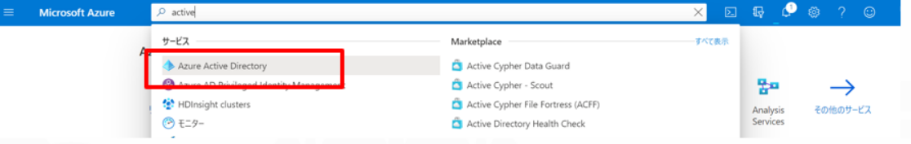
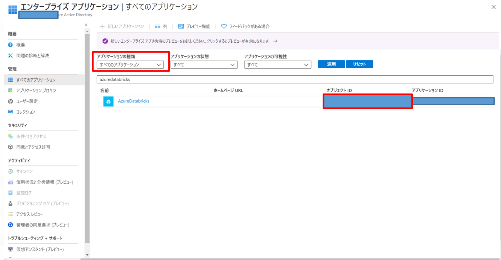

## DatabricksIDの確認方法

[Azure Portal](https://portal.azure.com)に移動して、ActiveDirectoryを検索します。

「エンタープライズアプリケーション」タブに移動して、アプリケーションの種類を **「全てのアプリケーション」** に変更したうえで「AzureDatabricks」を選択すると、オブジェクトIDが表示されます。

